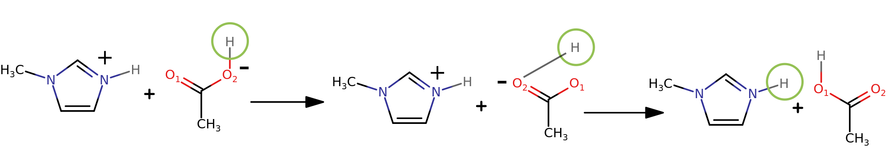

.. _Detailed-Example:

Detailed Example
=================

.. admonition:: |:confetti_ball:| Congratulations! |:confetti_ball:|
   :class: successstyle

   It seems you really want to learn how to use protex! 
   Keep going! |:smile:|

Setup
-----

Now, we will dive a little bit deeper in all the functions and methods protex offers. 
First and foremost, we need to make sure to have valid input files.
The usual way is to provide a psf and crd file alongside the toppar files. 
The topology and parameter files (toppar) contain all the residues needed for the system setup.
It is really important that the corresponding residues prone to (de-)protonation have the same number of atoms in the same order.
So, i.e if we have methylimidazolium (im1h) and methylimidazole (im1) the missing hydrogen for im1 needs to be a dummy atom. The same is true for acetate/acetic acid.
Additionally, make sure that also atoms in the coordinate files match the residue description. 

.. attention:: 
    It is VERY important that the atom order of the protonated and deprotonated residues match exactly between the coordinate as well as topology/psf files!

Examplary snippet of the RESI section of a CHARMM input structure. Please note the same atom ordering between the residues. 
Additionally, the coordinate files need to have the same ordering as well.

.. code-block:: bash

    RESI  IM1    0.0000     ||      RESI  IM1H  1.0000
    GROUP                   ||      GROUP
    ATOM  C1     CD33G      ||      ATOM  C1     CD33F 
    ATOM  H1     HDA3A      ||      ATOM  H1     HDA3A
    ATOM  H2     HDA3A      ||      ATOM  H2     HDA3A
    ATOM  H3     HDA3A      ||      ATOM  H3     HDA3A
    ATOM  N1     ND2R5A     ||      ATOM  N1     ND2R5C
    ATOM  C2     CD2R5A     ||      ATOM  C2     CD2R5D
    ATOM  H4     HDR5A      ||      ATOM  H4     HDR5D
    ATOM  C3     CD2R5A     ||      ATOM  C3     CD2R5D
    ATOM  H5     HDR5A      ||      ATOM  H5     HDR5D
    ATOM  C4     CD2R5B     ||      ATOM  C4     CD2R5E
    ATOM  H6     HDR5B      ||      ATOM  H6     HDR5E
    ATOM  N2     ND2R5B     ||      ATOM  N2     ND2R5C
    ATOM  H7     DUMMY H    ||      ATOM  H7     HDP1A
    ATOM  LPN21  LPD        ||      ATOM  LPN21  LPD  

Now, let's start building our system. The first part, getting the OpenMM simulation object is nothing protex specific and we won't need any protex functions for it. 
Nevertheless, here is one possible way to do it, if you are not that familiar with OpenMM.

.. note:: 
    All the files we need for this exemplary system can be found in the templates or forcefield directory. 

.. code-block:: python

    from openmm import Platform
    from openmm.app import PME, CharmmCrdFile, CharmmParameterSet, CharmmCrdFile, Simulation
    from openmm.unit import angstroms, kelvin, picoseconds
    from velocityverletplugin import VVIntegrator

    protex_dir = "/path/to/your/protex/directory"

    print("Loading CHARMM files...")
    PARA_FILES = ["toppar_drude_master_protein_2013f_lj025.str", "hoac_d.str", "im1h_d.str", "im1_d.str", "oac_d.str"]
    params = CharmmParameterSet(*[f"{protex_dir}/forcefield/toppar/{para_files}" for para_files in PARA_FILES])
    psf = CharmmPsfFile(f"{protex_dir}/forcefield/im1h_oac_150_im1_hoac_350.psf")
    psf.setBox(48*angstroms, 48*angstroms, 48*angstroms)
    crd = CharmmCrdFile(f"{protex_dir}/forcefield/im1h_oac_150_im1_hoac_350.crd")

    print("Create system")
    system = psf.createSystem(params, nonbondedMethod=PME, nonbondedCutoff=11.0 * angstroms, switchDistance=10 * angstroms, constraints=None)

    print("Setup simulation")
    integrator = VVIntegrator(300 * kelvin, 10 / picoseconds, 1 * kelvin, 100 / picoseconds, 0.0005 * picoseconds)
    integrator.setMaxDrudeDistance(0.25 * angstroms)
    platform = Platform.getPlatformByName("CUDA")
    prop = dict(CudaPrecision="single")
    simulation = Simulation(psf.topology, system, integrator, platform=platform, platformProperties=prop)
    simulation.context.setPositions(crd.positions)

Now we have the simulation object ready. In principle, we did what was done with ``generate_im1h_oac_system()``.
For advanced usage of this function see the :ref:`Advanced setup` section.

Next, we construct the ``ProtexTemplates`` class, which will be needed beside the simulation object to build the ``ProtexSystem``.
Two parts are needed. On the one hand a dictionary, with the settings for the possible transfers. 
The key is always a frozenset of the transfer reaction, while the value is another dictionary with the keywords "r_min", "r_max" and "prob".
"prob" is the probability for this reaction, "r_max" is the maximum distance (in Angstrom), and "r_min" is the distance where the distance-based
scaling of the probability starts, if it is used.
Note that it is equivalent to write ``frozenset(["IM1H", "OAC"])`` or ``frozenset(["OAC", "IM1H"])``.

The second ingredient is another dictionary specifiying the acceptor/donor atom name. 
So in our example from above, we want the hydrogen H7 from IM1H to be transfered to the nitrogen N2 of IM1.
This information belongs together, so it is grouped in one dictionary, as can be seen in the next code snippet.

A second (de-)protonable site can be specified for each residue with the "equivalent_atom" keyword.
You will have to use the ``KeepHUpdate`` update methode (see later).

.. attention::
    As of now, only small molecules, such as alcohols and carboxylic acids will work with equivalent atoms, due to how we reorient the molecule
    during proton transfer. More complex molecules, or protonation sites far away from each other are currently not possible. We are working on
    amphoteric molecules, i.e., molecules that can be proton donors, as well as acceptors.

The ``ProtexTemplates`` class accepts now a list, of all dictionaries with the specified atoms, as well as the allowed_updates dictionary.

.. code-block:: python

    from protex.system import ProtexTemplates

    allowed_updates = {}
    allowed_updates[frozenset(["IM1H", "OAC"])] = {"r_max": 0.16, "prob": 0.994}
    allowed_updates[frozenset(["IM1", "HOAC"])] = {"r_max": 0.16, "prob": 0.098}

    IM1H_IM1 = {"IM1H": {"atom_name": "H7"},
                 "IM1": {"atom_name": "N2"}}

    OAC_HOAC = {"OAC" : {"atom_name": "O2", "equivalent_atom": "O1"},
                "HOAC": {"atom_name": "H"}}

    templates = ProtexTemplates([OAC_HOAC, IM1H_IM1], allowed_updates)

Now we have everything to build the ``ProtexSystem``:

.. code-block:: python

    from protex.system import ProtexSystem

    ionic_liquid = ProtexSystem(simulation, templates)

If your simulation box doesn't contain all species that can be formed during the simulation (e.g., if you start with 
only neutral molecules of IM1 and HOAc, and let the ions develop in the course of the simulation), you need another simulation object
for protex to get the templates for the missing residues. It is enough to pack a box with one molecule each of every possible residue.
Then, you have to include this simulation in your ``ProtexSystem``:

.. code-block:: python

    ionic_liquid = ProtexSystem(simulation, templates, simulation_for_parameters=simulation_for_parameters)

Next, define the update method. Currently there are two update methods available. ``NaiveMCUpdate`` is the simpler one.
It uses the information passed before to determine the distance criterion for the specific update pairs and the probability.
NaiveMCUpdate accepts two more keywords:

.. object:: NaiveMCUpdate
 
   .. object:: parameters
 
       .. option:: ionic_liquid: ProtexSystem
 
           The Protex system
 
       .. option:: all_forces: bool = True
 
           Wether to change all forces during an update (default), or just the non bonded force (all_forces=False)
 
       .. option:: to_adapt: list[tuple[str, int, frozenset[str]]] = None

            This option is used to keep certain residues around an equilibrium value. 
            The tuple consists of the name of the residue, the amount of molecules, and the update set, for which the probability will be accordingly altered.

            **Important:** If using this option in consecutive runs, consider using the save_updates and load_updates methods of ionic liquid to get the current probability values.

.. code-block:: python

    from protex.update import NaiveMCUpdate, StateUpdate

    to_adapt = [("IM1H", 150, frozenset(["IM1H", "OAC"])), ("IM1", 350, frozenset(["IM1", "HOAC"]))]
    update = NaiveMCUpdate(ionic_liquid, all_forces=True, to_adapt=to_adapt)
    state_update = StateUpdate(update)

The ``NaiveMCUpdate`` doesn't work well with equivalent atoms, as it only considers the atom names given in the templates when checking for candidates. If you have equivalent atoms,
we recommend using the ``KeepHUpdate``, which also considers the equivalent atoms when checking distances. Here, you have the additional keywords ``include_equivalent_atom`` and ``reorient``,
to specify whether you want to consider the equivalent atoms at all, and whether to simply switch the dummy atoms on and off, or if you want to reorient the molecule so that the final configuration
after the transfer looks more like what you would expect chemically. 

    Exchanging the positions of the equivalent Os of OAc. Dummy Hs are marked with a green circle. As the O
    without the dummy H (O1) is closer to the donated proton than O2, their positions are swapped. After the transfer,
    the position of the H of HOAc is also updated. The unnaturally long O-H bond in the middle step does not lead to
    problems, as there are no simulation steps during the reorientation. Without reorientation, OAc would be updated as it is,
    causing the proton to jump an unphysically long distance.

Optionally, you can define reporters for the simulation. 
Protex has a built in ``ChargeReporter`` to report the current charges of all molecules which can just be added to the simulation like all other OpenMM reporters.
This is helpful for keeping track of the current state of each residue when analysing the trajectories later. Note that you cannot easily select residues by name only, 
as you might be used to, as e.g. MDAnalysis only reads the residue names from your starting topology and doesn't know which molecules were involved in proton transfers during the simulation.
You can define an additional header line with arbitrary informtion, e.g. on system settings.

.. code-block:: python

    from protex.reporter import ChargeReporter

    save_freq = 200
    infos={f"Put whatever additional infos you would like the charge reporter to store here, e.g. save_freq: {save_freq}"}
    charge_reporter = ChargeReporter(f"path/to/outfile", save_freq, ionic_liquid, header_data=infos)
    ionic_liquid.simulation.reporters.append(charge_reporter)

You can add additional OpenMM reporters:

.. code-block:: python

    from openmm.app import StateDataReporter, DCDReporter

    report_frequency = 200
    ionic_liquid.simulation.reporters.append(DCDReporter(f"traj.dcd", report_frequency))
    state_data_reporter= StateDataReporter(sys.stdout,
        report_frequency,
        step=True,
        time=True,
        potentialEnergy=True,
        kineticEnergy=True,
        totalEnergy=True,
        temperature=True,
        volume=True,
        density=False,
    )
    ionic_liquid.simulation.reporters.append(state_data_reporter)

Now you are ready to run the simulation and just call the update method whenever you like.
The ``state_update.update()`` method an integer as argument specifying the intermediate lambda-states for an update. 
2 means no intermediate steps, just one before and one after the update. Consequently every number n, means n-2 actual intermediate steps.

You can also save a psf file at any point during the simulation or store the current update values for the probability.
Due to current limitations on the conversion of Drude OpenMM toplogoies to ParmEd structures, the user has to supply a reference psf file.
This can just be the initial psf file used for the system creation.

.. code-block:: python

    ionic_liquid.simulation.step(1000)
    state_update.update(2)
    ionic_liquid.save_updates("updates.txt")
    ionic_liquid.write_psf("im1h_oac_150_im1_hoac_350.psf", "new.psf")

.. _Advanced Setup:

Advanced Setup
--------------

One usual way might be to do multiple runs, which means restarting the simulation after some time. There are some options in protex which should help.
Use the `psf_file` argument to load the current psf and the `restart_file` argument to load the current restart file. Alternatively new coordinates can also be specified via `load_checkpoint()`

.. code-block:: python

    from protex.testsystems import generate_im1h_oac_system

    psf_file = "psf_file_from_previous_run.psf"
    restart_file = "restart_file.rst"
    simulation = generate_im1h_oac_system(psf_file=psf_file,restart_file=restart_file)
    
    ...

    ionic_liquid.load_updates("updates.txt")
    ionic_liquid.loadCheckpoint("nvt_checkpoint.rst")

    ...

    ionic_liquid.save_updates("updates.txt")
    ionic_liquid.write_psf("im1h_oac_150_im1_hoac_350.psf", "nvt.psf")
    ionic_liquid.saveCheckpoint("nvt_checkpoint.rst")
